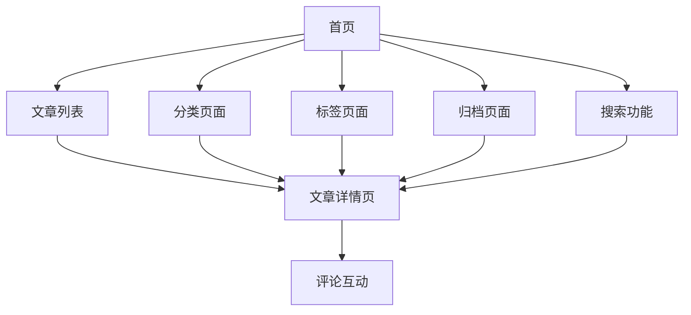

# VuePress-Theme-Vdoing 博客系统产品需求文档

## 1. 产品概述

VuePress-Theme-Vdoing 是一个基于 VuePress 的知识管理兼博客主题系统，旨在轻松构建结构化与碎片化并存的个人在线知识库。
该系统专为程序员设计，提供简洁高效的 Markdown 为中心的项目结构，内置自动化工具，配合多维索引快速定位每个知识点。
目标是打造一个好用的、面向程序员的知识管理工具，让知识海洋像一本本书一样清晰易读。

## 2. 核心功能

### 2.1 用户角色

| 角色   | 注册方式   | 核心权限                   |
| ---- | ------ | ---------------------- |
| 博客作者 | 直接部署配置 | 可创建、编辑、发布文章，管理网站配置     |
| 访问者  | 无需注册   | 可浏览文章、搜索内容、查看分类标签、评论互动 |

### 2.2 功能模块

本博客系统包含以下主要页面：

1. **首页**：英雄区块、特色功能展示、文章列表、博主信息侧边栏
2. **文章详情页**：文章内容展示、目录导航、评论系统、上下篇导航
3. **分类页面**：按分类展示文章列表、分类统计信息
4. **标签页面**：标签云展示、按标签筛选文章
5. **归档页面**：按时间线展示所有文章、年份分组
6. **关于页面**：博主个人信息、联系方式、网站介绍

### 2.3 页面详情

| 页面名称  | 模块名称 | 功能描述                            |
| ----- | ---- | ------------------------------- |
| 首页    | 英雄区块 | 展示网站标题、标语、特色功能卡片，支持响应式轮播        |
| 首页    | 文章列表 | 支持详细版和简约版两种显示模式，包含分页功能          |
| 首页    | 侧边栏  | 博主信息卡片、分类导航、标签云、自定义HTML模块       |
| 文章详情页 | 内容区域 | Markdown渲染、代码高亮、Demo演示模块、数学公式支持 |
| 文章详情页 | 导航系统 | 文章目录、面包屑导航、上下篇文章导航              |
| 文章详情页 | 交互功能 | 代码一键复制、图片缩放、评论系统(Gitalk)        |
| 分类页面  | 分类展示 | 分类列表、文章数量统计、分类文章列表              |
| 标签页面  | 标签云  | 标签大小按文章数量调整、标签筛选功能              |
| 归档页面  | 时间线  | 按年份月份分组展示文章、时间轴样式               |
| 搜索功能  | 全文搜索 | 本地搜索、第三方搜索链接(MDN、Runoob等)       |

## 3. 核心流程

### 博客作者流程

1. 配置网站基本信息和主题参数
2. 在docs目录下创建Markdown文件
3. 设置文章frontmatter(标题、分类、标签等)
4. 执行构建命令生成静态网站
5. 部署到服务器或静态托管平台

### 访问者流程

1. 访问首页浏览最新文章和特色内容
2. 通过导航栏或侧边栏进入不同分类
3. 使用搜索功能查找特定内容
4. 阅读文章详情，查看代码示例
5. 通过评论系统进行互动交流

## 4. 用户界面设计

### 4.1 设计风格

* **主色调**：蓝色系(#11a8cd)为主，灰色系为辅

* **按钮样式**：圆角按钮，支持悬停效果和主题切换

* **字体**：系统默认字体栈，支持中英文混排

* **布局风格**：卡片式布局，响应式设计，支持移动端适配

* **图标风格**：使用iconfont图标库，简洁现代

### 4.2 页面设计概览

| 页面名称 | 模块名称 | UI元素                     |
| ---- | ---- | ------------------------ |
| 首页   | 英雄区块 | 渐变背景、大标题、特色卡片网格布局、移动端轮播  |
| 首页   | 导航栏  | 固定顶部、Logo、菜单项、搜索框、主题切换按钮 |
| 首页   | 侧边栏  | 卡片式布局、头像、社交链接、分类标签云      |
| 文章页  | 内容区域 | 白色背景卡片、代码块语法高亮、表格样式      |
| 文章页  | 目录导航 | 右侧固定、滚动高亮、层级缩进           |
| 通用   | 页脚   | 版权信息、备案号、社交链接            |

### 4.3 响应式设计

* **桌面优先**：主要针对桌面端设计，屏幕宽度1200px+最佳体验

* **移动端适配**：720px以下触发移动端布局，侧边栏收起，特色卡片改为轮播

* **触摸优化**：移动端支持手势滑动、点击反馈、合适的触摸目标大小

