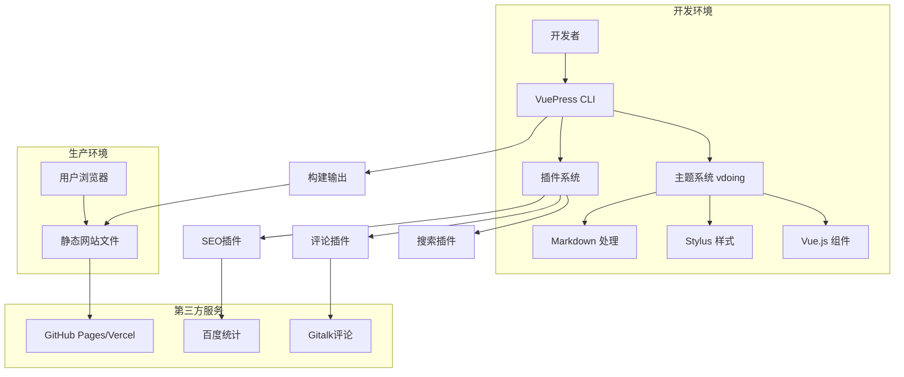
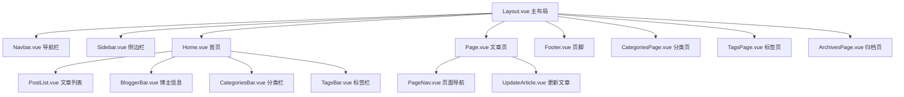
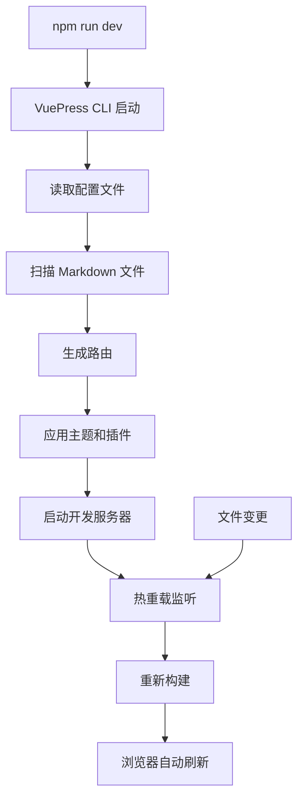
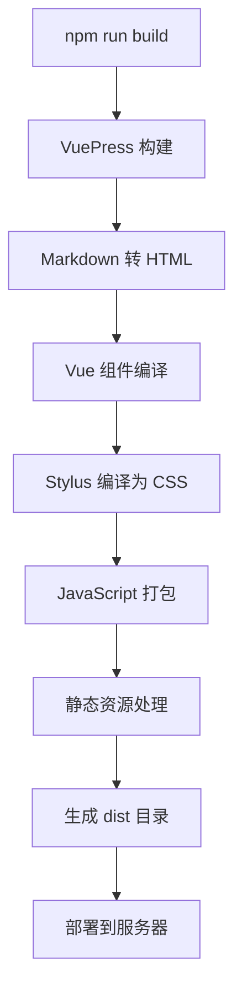
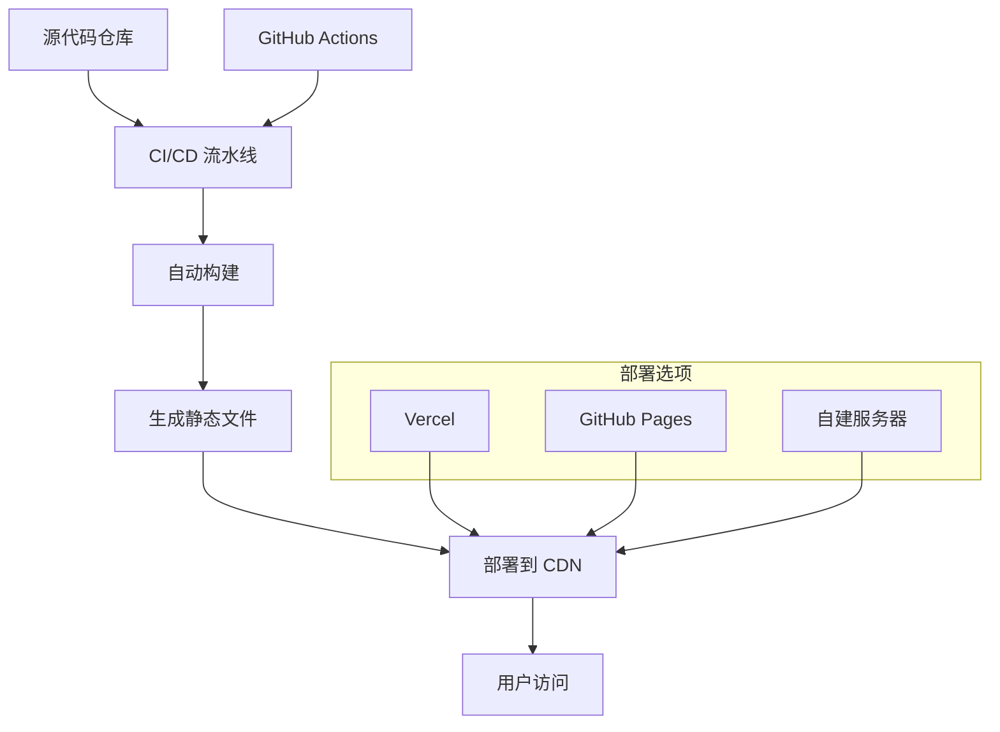

# VuePress-Theme-Vdoing 技术架构文档

## 1. 架构设计



## 2. 技术描述

* **前端框架**: VuePress\@1.9.9 + <Vue.js@2.x>

* **主题系统**: vuepress-theme-vdoing\@1.12.9 (自定义主题)

* **样式预处理**: Stylus\@0.54.5

* **构建工具**: VuePress CLI + Webpack (内置)

* **部署方式**: 静态文件部署 (GitHub Pages/Vercel/Nginx)

## 3. 路由定义

| 路由                           | 用途              |
| ---------------------------- | --------------- |
| /                            | 首页，显示博客主要内容和导航  |
| /categories/                 | 分类页面，展示所有文章分类   |
| /tags/                       | 标签页面，展示标签云和标签筛选 |
| /archives/                   | 归档页面，按时间线展示文章   |
| /about/                      | 关于页面，博主信息和联系方式  |
| /\[category]/\[article].html | 文章详情页，动态路由      |

## 4. 核心组件架构

### 4.1 主题组件层次



### 4.2 插件系统

```mermaid
graph TD
    A[VuePress 核心] --> B[主题插件]
    A --> C[官方插件]
    A --> D[第三方插件]
    
    B --> E[container 容器插件]
    B --> F[smooth-scroll 平滑滚动]
    
    C --> G[@vuepress/plugin-search 搜索]
    C --> H[@vuepress/plugin-nprogress 进度条]
    C --> I[@vuepress/active-header-links 标题链接]
    
    D --> J[vuepress-plugin-comment 评论]
    D --> K[vuepress-plugin-sitemap 站点地图]
    D --> L[vuepress-plugin-baidu-tongji 百度统计]
    D --> M[vuepress-plugin-one-click-copy 代码复制]
    D --> N[vuepress-plugin-zooming 图片缩放]
```

## 5. 数据模型

### 5.1 文章数据结构

```typescript
interface Article {
  title: string           // 文章标题
  date: string           // 发布日期
  permalink?: string     // 永久链接
  categories?: string[]  // 分类
  tags?: string[]       // 标签
  author?: {
    name: string
    link?: string
  }
  sidebar?: boolean     // 是否显示侧边栏
  editLink?: boolean    // 是否显示编辑链接
  content: string       // 文章内容(Markdown)
}
```

### 5.2 主题配置结构

```typescript
interface VdoingThemeConfig {
  nav: NavItem[]                    // 导航配置
  sidebar: 'auto' | 'structuring' | SidebarConfig  // 侧边栏配置
  author: {
    name: string
    link?: string
  }
  blogger?: {
    avatar: string
    name: string
    slogan: string
  }
  social?: {
    icons: SocialIcon[]
  }
  footer?: {
    createYear: number
    copyrightInfo: string
  }
  category?: boolean               // 是否启用分类
  tag?: boolean                   // 是否启用标签
  archive?: boolean               // 是否启用归档
  bodyBgImg?: string | string[]   // 背景图片
  rightMenuBar?: boolean          // 右侧菜单栏
  sidebarOpen?: boolean           // 侧边栏默认状态
}
```

## 6. 构建流程

### 6.1 开发构建流程



### 6.2 生产构建流程



## 7. 部署架构

### 7.1 静态部署方案



### 7.2 性能优化

* **代码分割**: VuePress 自动进行路由级别的代码分割

* **预渲染**: 构建时生成静态 HTML，提升首屏加载速度

* **资源压缩**: 自动压缩 CSS、JavaScript 和图片资源

* **缓存策略**: 静态资源添加版本号，支持长期缓存

* **CDN 加速**: 支持部署到全球 CDN 网络

## 8. 开发工具链

* **包管理**: npm/yarn

* **版本控制**: Git

* **代码规范**: ESLint + Prettier

* **构建工具**: VuePress CLI (基于 Webpack)

* **开发服务器**: VuePress Dev Server (支持热重载)

* **部署工具**: GitHub Actions / Vercel CLI

## 9. 扩展性设计

### 9.1 插件扩展

* 支持 VuePress 官方插件生态

* 可自定义开发插件扩展功能

* 主题内置容器插件支持自定义样式

### 9.2 主题定制

* 支持通过配置文件自定义主题参数

* 可覆盖默认组件实现个性化定制

* 支持自定义 CSS 样式覆盖

* 提供多种布局模式选择

