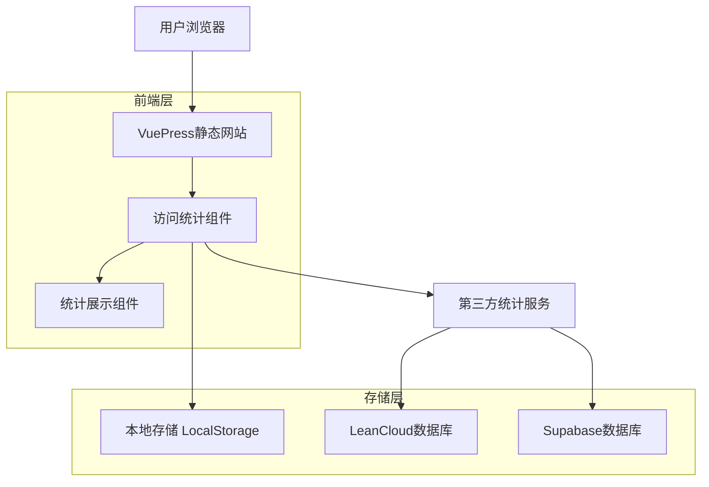

# VuePress博客系统访问统计功能技术方案

## 1. 功能概述

为VuePress-Theme-Vdoing博客系统添加访问统计功能，包括：
- 网站总访问次数统计
- 单篇文章访问次数统计
- 访问数据的持久化存储
- 前端实时展示统计数据

## 2. 技术架构设计

### 2.1 整体架构



### 2.2 技术选型对比

| 方案 | 优点 | 缺点 | 适用场景 |
|------|------|------|----------|
| LeanCloud | 免费额度充足、API简单、国内访问快 | 需要实名认证、有请求限制 | 个人博客、中小型网站 |
| Supabase | 功能强大、PostgreSQL、实时订阅 | 国外服务、可能被墙 | 技术博客、开发者网站 |
| 本地存储 | 无需服务器、响应快速 | 数据不同步、清除后丢失 | 简单统计、离线场景 |
| 百度统计 | 专业统计、详细分析 | 只能查看不能展示、需要审核 | 配合使用、数据分析 |

## 3. 推荐实现方案

### 3.1 混合存储方案

**主存储：LeanCloud** + **辅助存储：LocalStorage** + **分析工具：百度统计**

#### 3.1.1 LeanCloud配置

```javascript
// 初始化LeanCloud
import AV from 'leancloud-storage'

AV.init({
  appId: 'your-app-id',
  appKey: 'your-app-key',
  serverURL: 'https://your-domain.lc-cn-n1-shared.com'
})

// 数据模型
const PageView = AV.Object.extend('PageView')
const SiteView = AV.Object.extend('SiteView')
```

#### 3.1.2 数据模型设计

**网站访问统计表 (SiteView)**
```javascript
{
  id: String,           // 唯一标识
  totalViews: Number,   // 总访问次数
  todayViews: Number,   // 今日访问次数
  lastUpdate: Date,     // 最后更新时间
  date: String         // 日期(YYYY-MM-DD)
}
```

**文章访问统计表 (PageView)**
```javascript
{
  id: String,           // 唯一标识
  url: String,          // 文章URL路径
  title: String,        // 文章标题
  views: Number,        // 访问次数
  lastView: Date,       // 最后访问时间
  createdAt: Date,      // 创建时间
  updatedAt: Date       // 更新时间
}
```

### 3.2 前端组件设计

#### 3.2.1 访问统计服务类

```javascript
// utils/analytics.js
class AnalyticsService {
  constructor() {
    this.isInitialized = false
    this.cache = new Map()
  }

  // 初始化服务
  async init() {
    try {
      // 初始化LeanCloud
      await this.initLeanCloud()
      this.isInitialized = true
    } catch (error) {
      console.warn('Analytics service init failed:', error)
      // 降级到本地存储
      this.useLocalStorage = true
    }
  }

  // 记录页面访问
  async recordPageView(url, title) {
    if (this.useLocalStorage) {
      return this.recordPageViewLocal(url, title)
    }
    return this.recordPageViewRemote(url, title)
  }

  // 获取页面访问次数
  async getPageViews(url) {
    if (this.cache.has(url)) {
      return this.cache.get(url)
    }
    
    const views = this.useLocalStorage 
      ? this.getPageViewsLocal(url)
      : await this.getPageViewsRemote(url)
    
    this.cache.set(url, views)
    return views
  }

  // 获取网站总访问次数
  async getSiteViews() {
    return this.useLocalStorage 
      ? this.getSiteViewsLocal()
      : await this.getSiteViewsRemote()
  }
}

export default new AnalyticsService()
```

#### 3.2.2 Vue组件实现

**网站访问统计组件**
```vue
<!-- components/SiteViewCounter.vue -->
<template>
  <div class="site-view-counter">
    <i class="icon-eye"></i>
    <span class="label">总访问量：</span>
    <span class="count">{{ formatNumber(totalViews) }}</span>
  </div>
</template>

<script>
import AnalyticsService from '@/utils/analytics'

export default {
  name: 'SiteViewCounter',
  data() {
    return {
      totalViews: 0
    }
  },
  async mounted() {
    await this.loadSiteViews()
  },
  methods: {
    async loadSiteViews() {
      try {
        this.totalViews = await AnalyticsService.getSiteViews()
      } catch (error) {
        console.error('Failed to load site views:', error)
      }
    },
    formatNumber(num) {
      if (num >= 10000) {
        return (num / 10000).toFixed(1) + 'w'
      }
      return num.toLocaleString()
    }
  }
}
</script>

<style lang="stylus">
.site-view-counter
  display inline-flex
  align-items center
  color var(--text-color-sub)
  font-size 0.9em
  
  .icon-eye
    margin-right 4px
    
  .count
    font-weight 500
    color var(--accent-color)
</style>
```

**文章访问统计组件**
```vue
<!-- components/PageViewCounter.vue -->
<template>
  <div class="page-view-counter">
    <i class="icon-eye"></i>
    <span class="count">{{ formatNumber(views) }}</span>
  </div>
</template>

<script>
import AnalyticsService from '@/utils/analytics'

export default {
  name: 'PageViewCounter',
  props: {
    url: {
      type: String,
      required: true
    },
    title: {
      type: String,
      default: ''
    }
  },
  data() {
    return {
      views: 0
    }
  },
  async mounted() {
    await this.recordAndLoadViews()
  },
  methods: {
    async recordAndLoadViews() {
      try {
        // 记录访问
        await AnalyticsService.recordPageView(this.url, this.title)
        // 获取访问次数
        this.views = await AnalyticsService.getPageViews(this.url)
      } catch (error) {
        console.error('Failed to record page view:', error)
      }
    },
    formatNumber(num) {
      if (num >= 10000) {
        return (num / 10000).toFixed(1) + 'w'
      }
      return num.toLocaleString()
    }
  }
}
</script>
```

### 3.3 主题集成方案

#### 3.3.1 在文章页面集成

```vue
<!-- vdoing/components/Page.vue -->
<template>
  <main class="page">
    <!-- 文章信息栏 -->
    <div class="page-meta" v-if="showPageMeta">
      <ArticleInfo :pageInfo="pageInfo" />
      <!-- 添加访问统计 -->
      <PageViewCounter 
        :url="$page.path" 
        :title="$page.title"
        class="page-view-counter"
      />
    </div>
    
    <!-- 文章内容 -->
    <Content class="theme-default-content" />
  </main>
</template>

<script>
import PageViewCounter from './PageViewCounter.vue'

export default {
  components: {
    PageViewCounter
  }
  // ... 其他代码
}
</script>
```

#### 3.3.2 在首页侧边栏集成

```vue
<!-- vdoing/components/BloggerBar.vue -->
<template>
  <div class="blogger-bar">
    <!-- 博主信息 -->
    <div class="blogger-info">
      <!-- ... 现有内容 -->
    </div>
    
    <!-- 网站统计 -->
    <div class="site-stats">
      <h4>网站统计</h4>
      <div class="stats-item">
        <SiteViewCounter />
      </div>
      <div class="stats-item">
        <span class="label">文章数量：</span>
        <span class="count">{{ $site.pages.length }}</span>
      </div>
    </div>
  </div>
</template>

<script>
import SiteViewCounter from './SiteViewCounter.vue'

export default {
  components: {
    SiteViewCounter
  }
}
</script>
```

## 4. 实现细节

### 4.1 防刷机制

```javascript
// 防止重复统计
class ViewTracker {
  constructor() {
    this.viewedPages = new Set()
    this.lastViewTime = new Map()
  }

  shouldRecord(url) {
    const now = Date.now()
    const lastTime = this.lastViewTime.get(url) || 0
    
    // 同一页面5分钟内不重复统计
    if (now - lastTime < 5 * 60 * 1000) {
      return false
    }
    
    this.lastViewTime.set(url, now)
    return true
  }
}
```

### 4.2 错误处理和降级

```javascript
// 优雅降级策略
class FallbackStorage {
  async recordView(url, title) {
    try {
      // 尝试远程存储
      await this.recordRemote(url, title)
    } catch (error) {
      // 降级到本地存储
      this.recordLocal(url, title)
    }
  }

  recordLocal(url, title) {
    const views = JSON.parse(localStorage.getItem('page_views') || '{}')
    views[url] = (views[url] || 0) + 1
    localStorage.setItem('page_views', JSON.stringify(views))
  }
}
```

### 4.3 性能优化

```javascript
// 批量更新和缓存
class PerformanceOptimizer {
  constructor() {
    this.updateQueue = []
    this.cache = new Map()
    this.batchTimer = null
  }

  // 批量提交更新
  queueUpdate(data) {
    this.updateQueue.push(data)
    
    if (this.batchTimer) {
      clearTimeout(this.batchTimer)
    }
    
    this.batchTimer = setTimeout(() => {
      this.flushUpdates()
    }, 2000) // 2秒后批量提交
  }

  async flushUpdates() {
    if (this.updateQueue.length === 0) return
    
    try {
      await this.batchUpdateRemote(this.updateQueue)
      this.updateQueue = []
    } catch (error) {
      console.error('Batch update failed:', error)
    }
  }
}
```

## 5. 配置和部署

### 5.1 主题配置

```javascript
// docs/.vuepress/config.js
module.exports = {
  themeConfig: {
    // 访问统计配置
    analytics: {
      enable: true,
      provider: 'leancloud', // 'leancloud' | 'supabase' | 'local'
      leancloud: {
        appId: 'your-app-id',
        appKey: 'your-app-key',
        serverURL: 'https://your-domain.lc-cn-n1-shared.com'
      },
      // 显示配置
      showSiteViews: true,     // 显示网站总访问量
      showPageViews: true,     // 显示文章访问量
      // 防刷配置
      cooldown: 300000,        // 5分钟冷却时间
      enableLocalFallback: true // 启用本地存储降级
    }
  }
}
```

### 5.2 环境变量配置

```bash
# .env.local
VUE_APP_LEANCLOUD_APP_ID=your-app-id
VUE_APP_LEANCLOUD_APP_KEY=your-app-key
VUE_APP_LEANCLOUD_SERVER_URL=https://your-domain.lc-cn-n1-shared.com
```

## 6. 安全考虑

### 6.1 数据安全

- 使用HTTPS传输数据
- API密钥通过环境变量配置
- 实施访问频率限制
- 数据验证和清洗

### 6.2 隐私保护

- 不收集用户个人信息
- 仅统计页面访问次数
- 支持用户禁用统计功能
- 遵循GDPR等隐私法规

## 7. 监控和维护

### 7.1 错误监控

```javascript
// 错误上报
class ErrorReporter {
  static report(error, context) {
    console.error('Analytics Error:', error, context)
    
    // 可选：上报到错误监控服务
    if (window.Sentry) {
      window.Sentry.captureException(error, { extra: context })
    }
  }
}
```

### 7.2 数据备份

- 定期导出LeanCloud数据
- 本地存储数据同步
- 数据恢复机制

## 8. 扩展功能

### 8.1 高级统计

- 访问来源统计
- 热门文章排行
- 访问趋势图表
- 用户行为分析

### 8.2 管理后台

- 统计数据可视化
- 实时访问监控
- 数据导出功能
- 异常告警机制

## 9. 总结

本方案采用LeanCloud作为主要存储方案，结合本地存储作为降级方案，既保证了数据的持久性和同步性，又确保了在网络异常情况下的可用性。通过合理的组件设计和性能优化，可以为VuePress博客系统提供稳定可靠的访问统计功能。