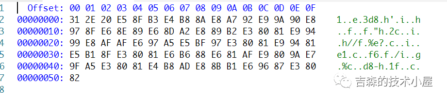

## 前言

最近在用Java做一个文件格式转化的工具（[github地址](https://github.com/lhing17/waterConverter.git)），希望通过简单的调用实现一些常用格式间的互相转换，实质上是一些处理不同文件格式的工具包的整合。借此机会，也对Java怎么处理不同格式的文件有了更深入的了解，希望写一系列的文章作为记录。作为开篇，先来聊一聊什么是二进制文件，以及二进制文件到底是怎么存储信息的。

## 文本文件 vs 二进制文件

我们常说，文件分为文本文件和二进制文件，这其实是一种很糙的分类方式。文件是文本文件还是二进制文件，这是逻辑上的概念，而不是物理上的概念。在物理上，文件都是基于二进制来存储的，文件存储的基本单位是字节，每个字节由8个二进制位组成。如果整个文件能够被某种软件全部解码为字符串，我们就认为这个文件是文本文件。也就是说，文本文件是一种特殊的二进制文件。

同样道理，某种二进制文件如果可以按照位图的方式去解码，它就可以显示为一张图片；如果可以按照 MPEG-3的规则解码，它就可以播放为音频。一些常见的文件格式，都是使用其相应的规范进行编码的。因此，我们可以根据规范编写相应解码的软件，用于读取这些格式的文件。也有一些二进制文件的编码格式是程序开发者自定义的，这样的文件对于普通的用户来说就几乎是保密的。

### Java Class文件结构

规范的二进制文件通常都是由多个多字节的序列组成的，每个多字节的序列承载一部分信息。我们以Java的Class文件为例，Class文件是以无符号数和表两种结构来存储信息。

无符号数属于基本数据类型，以u1、u2、u4、u8来分别代表1个字节、2个字节、4个字节和8个字节的无符号数，无符号数可以用来描述数字、索引引用、数量值或者按照UTF-8编码构成字符串值。表是由多个无符号数或者其他表作为数据项构成的复合数据类型，为了便于区分，所有表的命名都习惯性地以"_info"结尾。表用于描述有层次关系的复合数据，整个Class文件本质上也可以视作是一张表，这张表由下表所示的数据项按严格顺序排列构成。

**表1 Class文件格式**

| 类型 | 名称 | 数量 |
|------|------|------|
| u4 | magic | 1 |
| u2 | minor_version | 1 |
| u2 | major_version | 1 |
| u2 | constant_pool_count | 1 |
| cp_info | constant_pool | constant_pool_count-1 |
| u2 | access_flags | 1 |
| u2 | this_class | 1 |
| u2 | super_class | 1 |
| u2 | interfaces_count | 1 |
| u2 | interfaces | interfaces_count |
| u2 | fields_count | 1 |
| field_info | fields | fields_count |
| u2 | methods_count | 1 |
| method_info | methods | methods_count |
| u2 | attributes_count | 1 |
| attribute_info | attributes | attributes_count |

## 使用Hexdump类工具查看二进制文件

有的时候，为了开发方便，我们需要去查看二进制文件的结构。前面提到，二进制文件的基本单位是字节，一个字节是由8个二进制位（0或1）组成的。二进制书写和阅读起来都很不方便，为了读写方便，我们通常把二进制转化为16进制。16是2的4次方，因此一个16进制数可以代表4个2进制位。这样，我们就可以用两个16进制数来代表一个字节。有一些工具可以用来查看文件的16进制表示，如Hexdump。Hexdump最初是linux系统上的命令，现在VSCode等工具都提供了hexdump的插件。

**图1 VSCode hexdump插件查看文件效果图**



如上图，左侧是二进制文件的16进制表示，右侧是尝试解码为字符的表示。

## Little-endian vs Big-endian

当我们使用多个字节的序列来承载信息时，就出现了字节存储顺序的问题。我们可以把高位字节放在前面，也可以把低位字节放在前面，这就是我们平时说的little-endian和big-endian。

- **Little-endian**：将低序字节存储在起始地址（低位地址）
- **Big-endian**：将高序字节存储在起始地址（高位地址）

### 字节序示例

举个例子：我们有一个整型数据1，它在内存中占据了四个字节的空间，它的16进制表示为：

```text
0x00 00 00 01
```

在内存中怎么存储呢？

- 如果你的CPU是intel x86架构的（基本上就是通常我们说的奔腾cpu），那么就是 `0x01 0x00 0x00 0x00`，这也就是所谓的little-endian，低字节存放在内存的低位。
- 如果你的CPU是老式AMD系列的（很老很老的那种，因为最新的AMD系列已经是x86架构了），它的字节序就是big-endian，其内存存储就是 `0x00 0x00 0x00 0x01` 在内存中从高字节开始存放。

### Java是big-endian还是little-endian？

Java默认采用big-endian方式，如各种读写流中的 `readInt()` 方法都是从高位到低位读取四个字节转化为整数。如果文件的读写都是通过Java来实现的，我们通常不需要去关注字节序的问题。但是如果与那些不是使用Java编写的程序交换数据文件时，就需要考虑字节序的问题了。

## 参考文献

- 周志明《深入理解Java虚拟机》
- [Big Endian 和 Little Endian 详解](https://blog.csdn.net/waitingbb123/java/article/details/80504093)