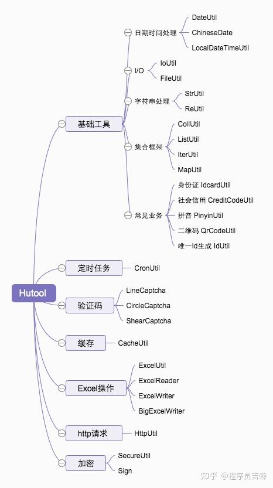

上次我们分享了谷歌高大上的工具包Guava，这次我们来分享一款更接地气的国产工具包Hutool。

Hutool是国内程序员在工作中总结和积累而成的一套小而全的工具类库，相比于Guava，它更符合国内开发者的需求。

Hutool首次发布于2014年，最新版本为5.6.5，到目前为止已经在github上收获了1.9万个赞。

我们还是先来看一下学习Hutool的思维导图。

<!-- more -->




下面列举一些常用的 API，仅供参考。

## 1. 基础工具

### 1.1 日期时间处理

日期操作的亮点是可以通过 `ChineseDate` 类将公历日期转换为农历日期。此外，使用 `DateUtil` 可以很方便的操作 `Date` 类型数据，`LocalDateTimeUtil` 则用于操作 `LocalDateTime` 类型数据。

```java
// 获取年份
int year = DateUtil.year(new Date());

// 获取今天日期 yyyy-MM-dd格式
String today = DateUtil.today();

// 获取生肖
String chineseZodiac = DateUtil.getChineseZodiac(1990);

// 将毫秒转成方便阅读的时间，如3小时25分23秒232毫秒
String readableTime = DateUtil.formatBetween(12323232);

// 转为农历日期
ChineseDate chineseDate = new ChineseDate(new Date());
// 农历年份，如2021
final int chineseYear = chineseDate.getChineseYear();
// 农历月份，如腊月
final String chineseMonthName = chineseDate.getChineseMonthName();
// 农历日期，如初三
final String chineseDay = chineseDate.getChineseDay();

// 方便地将Date转换为LocalDateTime
final LocalDateTime localDateTime = LocalDateTimeUtil.of(new Date());

// 获取一天开始时间
LocalDateTimeUtil.beginOfDay(localDateTime);
// 获取一天结束时间
LocalDateTimeUtil.endOfDay(localDateTime);
```
### 1.2 I/O 操作

`IoUtil` 可以方便地复制文件，其他相关 API 建议使用 JDK 的 `Files` 工具类。

```java
// 从文件中获取缓冲流
BufferedInputStream in = FileUtil.getInputStream("d:/test.txt");
BufferedOutputStream out = FileUtil.getOutputStream("d:/test2.txt");

// 拷贝文件
IoUtil.copy(in, out);
```
### 1.3 字符串处理

一些简单易用的字符串处理 API，以及正则表达式的 API。

```java
// 判断字符串是否为null或空串
boolean isEmpty = StrUtil.isEmpty(str);

// 判断字符串是否为null或空串或空白字符
boolean isBlank = StrUtil.isBlank(str);

// 将字符串用指定字符填充到指定长度
String filled = StrUtil.fillAfter(str, '*', 10);

// 填充字符串模板
String format = StrUtil.format("a的值为{a}, b的值为{b}", Map.of("a", "aValue", "b", "bValue"));

// 判断字符串是否为中文字符串
boolean match = ReUtil.isMatch(ReUtil.RE_CHINESES, "中国人");
```
### 1.4 集合框架

可以用于创建集合和集合的交、并、差集操作。

```java
// 新建一个HashSet
Set<Integer> hashSet = CollUtil.newHashSet(1, 2, 3);
Set<Integer> linkedHashSet = CollUtil.newLinkedHashSet(4, 2, 3);

// 两个集合取交集
Collection<Integer> intersection = CollUtil.intersection(hashSet, linkedHashSet);

// 两个集合取并集
Collection<Integer> union = CollUtil.union(hashSet, linkedHashSet);

// 两个集合取差集
Collection<Integer> disjunction = CollUtil.disjunction(hashSet, linkedHashSet);

// 判断一个集合是否为null或空集
boolean empty = CollUtil.isEmpty(hashSet);

// 创建一个ArrayList
List<Integer> arrayList = ListUtil.toList(1, 2, 3);

// 创建一个LinkedList
List<Integer> linkedList = ListUtil.toLinkedList(1, 2, 3);

// 创建一个map
Map<String, Object> map = MapUtil.<String, Object>builder().put("a", 1).put("b", 2).build();
```
### 1.5 常见业务

身份证、社会信用代码、拼音操作、生成二维码、生成唯一 ID 等一些常见业务场景 API。

```java
// 根据身份证号获取出生日期
String birth = IdcardUtil.getBirthByIdCard(idCard);

// 根据身份证号获取省份
String province = IdcardUtil.getProvinceByIdCard(idCard);

// 判断身份证号是否合法
boolean valid = IdcardUtil.isValidCard18(idCard);

// 获取一个随机的社会信用代码
String creditCode = CreditCodeUtil.randomCreditCode();

// 判断社会信用代码是否合法
boolean isCreditCode = CreditCodeUtil.isCreditCode(creditCode);

// 将汉字转为拼音，需要引入TinyPinyin、JPinyin或Pinyin4j的jar包
String china = PinyinUtil.getPinyin("中国");

// 将字符串生成为二维码，需要引入com.google.zxing.core的jar包
BufferedImage qrCodeImage = QrCodeUtil.generate("www.baidu.com", QrConfig.create());
ImageIO.write(qrCodeImage, "png", new File("a.png"));

// 生成uuid
String uuid = IdUtil.fastSimpleUUID();

// 创建基于Twitter SnowFlake算法的唯一ID，适用于分布式系统
final Snowflake snowflake = IdUtil.createSnowflake(1, 1);
final long id = snowflake.nextId();
```
## 2. 定时任务

通过简单的 API，实现全局统一的定时任务调度。

```java
// 添加新的定时任务
final String scheduleId = CronUtil.schedule("*/2 * * * * *", (Task) () -> System.out.println("执行定时任务"));

// 设置是否支持秒级别定时任务
CronUtil.setMatchSecond(true);

// 开启定时任务
CronUtil.start();
```
## 3. 验证码

可以方便地生成图形验证码。

```java
// 生成线段干扰的验证码
LineCaptcha lineCaptcha = CaptchaUtil.createLineCaptcha(200, 100, 5, 3);
lineCaptcha.write("/your/path/b.png");

// 生成圆圈干扰的验证码
CircleCaptcha captcha = CaptchaUtil.createCircleCaptcha(200, 100, 4, 20);
captcha.write("/your/path/c.png");

// 生成扭曲干扰的验证码
ShearCaptcha shearCaptcha = CaptchaUtil.createShearCaptcha(200, 100, 4, 4);
shearCaptcha.write("/your/path/d.png");
```
## 4. 缓存

可以方便地使用基于内存的缓存，并设置过期时间的策略。

```java
// 创建先进先出的缓存，并设置过期时间
FIFOCache<String, Object> cache = CacheUtil.newFIFOCache(1000, 3600 * 1000);

// 向缓存中添加元素
cache.put("a", 1);

// 从缓存中读取元素
cache.get("a");
```
## 5. Excel 操作

```java
// 将文件转换为ExcelReader
ExcelReader reader = ExcelUtil.getReader("d:/aaa.xlsx");

// 读取所有行和列的数据
List<List<Object>> data = reader.read();

// 读取为Map列表，默认excel第一行为标题行，Map中的key为标题，value为标题对应的单元格值。
List<Map<String,Object>> dataMap = reader.readAll();

//创建writer
ExcelWriter writer = ExcelUtil.getWriter("d:/bbb.xlsx");

// 数据量特别大时，使用BigExcelWriter对象，可以避免内存溢出
ExcelWriter bigWriter = ExcelUtil.getBigWriter("d:/bbb.xlsx");

// 构造数据
List<String> row1 = CollUtil.newArrayList("aa", "bb", "cc", "dd");
List<String> row2 = CollUtil.newArrayList("aa1", "bb1", "cc1", "dd1");
List<String> row3 = CollUtil.newArrayList("aa2", "bb2", "cc2", "dd2");
List<String> row4 = CollUtil.newArrayList("aa3", "bb3", "cc3", "dd3");
List<String> row5 = CollUtil.newArrayList("aa4", "bb4", "cc4", "dd4");
List<List<String>> rows = CollUtil.newArrayList(row1, row2, row3, row4, row5);

// 一次性将数据写入excel中
writer.write(rows, true);
```
## 6. HTTP 请求

```java
Map<String, Object> params = MapUtil.<String, Object>builder().put("a", 1).build();
// 发送get请求
String getResult = HttpUtil.get("https://www.baidu.com", params);

// 发送post请求
String postResult = HttpUtil.post("https://www.baidu.com", params);

// 以application/json方式发送post请求
String jsonPostResult = HttpUtil.post("https://www.baidu.com", JSON.toJSONString(params));

// 下载文件，提供生命周期钩子
HttpUtil.downloadFile(fileUrl, FileUtil.file("e:/"), new StreamProgress() {
    @Override
    public void start() {
        System.out.println("开始下载");
    }

    @Override
    public void progress(long progressSize) {
        System.out.println("下载中，已下载" + FileUtil.readableFileSize(progressSize));
    }

    @Override
    public void finish() {
        System.out.println("下载完成");
    }
});
```
## 7. 加密

### 7.1 加密和解密

```java
// md5摘要加密
String md5 = SecureUtil.md5("abc");

// sha1摘要加密
String sha1 = SecureUtil.sha1("abc");

// 生成非对称密钥对
KeyPair keyPair = SecureUtil.generateKeyPair("RSA");
String publicKey = Base64Encoder.encode(keyPair.getPublic().getEncoded());
String privateKey = Base64Encoder.encode(keyPair.getPrivate().getEncoded());

// 利用公钥加密
String encryptBase64 = SecureUtil.rsa(privateKey, publicKey).encryptBase64("abc", KeyType.PublicKey);

// 利用私钥解密
String decrypt = new String(SecureUtil.rsa(privateKey, publicKey).decrypt(encryptBase64, KeyType.PrivateKey));
```
### 7.2 签名和验签

```java
// 创建签名对象
Sign sign = SecureUtil.sign(SignAlgorithm.MD5withRSA);

// 生成签名
final byte[] bytes = "abc".getBytes();
byte[] signed = sign.sign(bytes);

// 验证签名
boolean verify = sign.verify(bytes, signed);
System.out.println(verify);
```
## 8. 其他说明

### 8.1 引入 Hutool

在项目中可以通过 Maven 引入 Hutool 库，方式如下：

```xml
<dependency>
    <groupId>cn.hutool</groupId>
    <artifactId>hutool-all</artifactId>
    <version>5.6.5</version>
</dependency>
```

### 8.2 注意事项

- Hutool 的定位是减少代码搜索成本，避免从网络上复制修改代码导致的潜在问题。
- 所有的类都有自己的使用场景，没有银弹。应该多读使用文档，看这些工具是否符合自己的使用场景。
- 本文仅列举了部分常用 API，整个工具包的内容非常广泛。如有需要，可到官网进一步深入学习。
