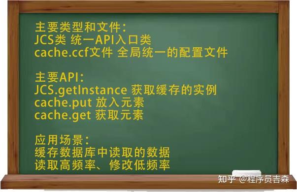

大家好，我是吉森。我会持续分享一些开发技巧、经验和技术，如果你也热爱各种开发技术，欢迎关注我。

今天是Apache Commons工具包系列技术的终篇，今天的主角是：Commons JCS3。JCS指Java caching system，即java缓存系统。

<!-- more -->

说到缓存，不少人可能比较熟悉Redis、Memcached之类的独立缓存中间件，或者是Ehcache这种应用较广的jvm内存缓存。在大中型项目中，这些都是不错的缓存技术选择。

相比之下，Commons JCS更加轻量级，适合一些比较小的项目使用。它和Apache commons的其他模块一脉相承，代码实现简单高效，且经过了充分的测试，是值得信赖的选择。

## 入门级介绍

### 什么是缓存？

在应用开发中提到的缓存通常是软件级别的缓存，指的是临时存储数据的空间，它的访问速度通常远远高于原始数据的访问速度。

### 缓存有什么用？

通过在应用中使用缓存技术，可以大幅度减少计算量，有效提升响应速度，使有限的硬件资源服务更多的用户。

### 缓存使用场景

缓存主要用于提高数据的读取效率，因此适于原始数据读取较慢的场景，如缓存从数据库中读取的数据。由于缓存的数据需要保证和原始数据同步，当数据被修改时，就需要刷新缓存了，因此缓存主要用于读取频繁、修改频率较低的应用。

## Commons JCS的核心概念

Commons JCS中最重要的三个概念为元素、区域以及附件。

- **元素**：JCS是基于对象的缓存。在JCS中，元素指的是放在缓存中的对象。我们可以通过一个唯一键来获取到缓存的元素。

- **区域**：JCS存储的结构有点类似于map的集合，其中每个map称为一个区域，每个区域可以进行独立配置。

- **附件**：附件是JCS中区域可以使用的可选插件。JCS中提供的主要附件有：具有索引的磁盘缓存、TCP水平扩展缓存以及远程缓存服务器。这些附件可以扩展缓存的能力，如磁盘缓存可以在内存达到临界值时，将元素保存到磁盘上。

## 引入Commons JCS

在maven工程中，可以通过maven坐标的方式进行引用。

```xml
<dependency>
    <groupId>org.apache.commons</groupId>
    <artifactId>commons-jcs3-core</artifactId>
    <version>3.0</version>
</dependency>
```

## 配置文件

### cache.ccf文件

JCS依赖一个名为cache.ccf文件来初始化缓存管理器。该文件可以自行创建，放在maven工程的src/main/resources目录下。一个典型的cache.ccf文件配置如下：

```properties
# 默认的缓存区域
jcs.default=
jcs.default.cacheattributes=org.apache.commons.jcs3.engine.CompositeCacheAttributes
jcs.default.cacheattributes.MaxObjects=1000 # 区域最多存储1000个对象
jcs.default.cacheattributes.MemoryCacheName=org.apache.commons.jcs3.engine.memory.lru.LRUMemoryCache # 缓存策略为LRU
jcs.default.cacheattributes.UseMemoryShrinker=false
jcs.default.cacheattributes.MaxMemoryIdleTimeSeconds=3600 # 内存最大闲置3600秒
jcs.default.cacheattributes.ShrinkerIntervalSeconds=60
jcs.default.elementattributes=org.apache.commons.jcs3.engine.ElementAttributes
jcs.default.elementattributes.IsEternal=false # 元素是否为永久元素
jcs.default.elementattributes.MaxLife=21600 # 元素最大存活时间为21600秒
jcs.default.elementattributes.IdleTime=1800 # 元素最大闲置时间为1800秒
jcs.default.elementattributes.IsSpool=true # 元素是否存到磁盘上
jcs.default.elementattributes.IsRemote=true # 元素是否存到远程服务器
jcs.default.elementattributes.IsLateral=true # 元素是否发送到其他节点

# 预定义的缓存区域
jcs.region.testCache1=DC
jcs.region.testCache1.cacheattributes=org.apache.commons.jcs3.engine.CompositeCacheAttributes
jcs.region.testCache1.cacheattributes.MaxObjects=1000
jcs.region.testCache1.cacheattributes.MemoryCacheName=org.apache.commons.jcs3.engine.memory.lru.LRUMemoryCache
jcs.region.testCache1.cacheattributes.UseMemoryShrinker=false
jcs.region.testCache1.cacheattributes.MaxMemoryIdleTimeSeconds=3600
jcs.region.testCache1.cacheattributes.ShrinkerIntervalSeconds=60
jcs.region.testCache1.cacheattributes.MaxSpoolPerRun=500
jcs.region.testCache1.elementattributes=org.apache.commons.jcs3.engine.ElementAttributes
jcs.region.testCache1.elementattributes.IsEternal=false
```

## Commons JCS的常用API

```java
try {
    // 获取指定区域的缓存
    final CacheAccess<String, Student> cache = JCS.getInstance("default");

    // 向缓存中加入元素，使用区域的默认属性
    Student student = new Student("zs", 20, 1);
    cache.put(student.getName(), student);

    // 向缓存中加入元素，并设置元素的属性
    final ElementAttributes elementAttributes = new ElementAttributes();
    // 设置最大有效时间为一小时
    elementAttributes.setMaxLife(3600);
    // 设置最大闲置时间为10分钟
    elementAttributes.setIdleTime(600);
    cache.put(student.getName(), student, elementAttributes);

    // 从缓存中读取数据
    final Student student1 = cache.get("zs");
    System.out.println(student1);
    System.out.println(student == student1);

    // 关闭缓存
    JCS.shutdown();

} catch (CacheException e) {
    e.printStackTrace();
}
```

缓存的操作有点像map，可以通过put方法添加元素，通过get方法获取元素。值得注意的是put方法除了传key和value参数外，还可以传一个元素属性的参数。如果不传该参数，则使用区域统一的元素属性（通常在cache.ccf文件中配置）。

缓存和map的一处区别是缓存通常具有失效时间，即缓存中的元素一段时间内不访问的话就会被移除。

## LRU缓存策略简介

除失效时间外，缓存的另一项限制是缓存通常有最大内存空间的限制。当达到这个限制后，缓存就需要移除一部分元素了。常见的淘汰元素的策略包括：

- **LRU**：最久未使用
- **MRU**：最近使用
- **FIFO**：先进先出（类似于队列）
- **LFU**：最少使用

其中最常用的是LRU。LRU的核心理念是假定如果数据在最近一段时间被访问，它在以后也会经常被访问。因此我们应该淘汰最久未使用的数据。

Commons JCS的LRU算法是基于双向链表（DoubleLinkedList）来实现的。对于新加入的元素，直接插入到链表的头部。对于被访问的元素，从原链表中移除，再插入到头部。当需要淘汰元素时，从尾部进行删除。

> **注**：LRU即Least Recently Used，指的是最长时间未使用的元素。有的地方将LRU译为最近最少使用，其实是一种错译。实际上LRU淘汰元素只和上一次使用时间相关，和使用频繁无关。

## 带索引的磁盘缓存

当内存达到限制时，可以通过Indexed Disk Cache相关配置将元素存储到磁盘上。写入磁盘的过程是一个连续的基于队列的过程。

写入磁盘的文件分为data和key两个文件：

- **data文件**：存储完整的数据，其中每一项数据的前几个字节存储的是该元素的长度
- **key文件**：存储所有的key，同时记录数据在data文件中的偏移量，这样可以快速从data文件中找到数据所在的位置

## 分布式扩展

当应用有多个节点时，可以使用TCP Lateral Cache和RMI Remote Cache两种方式进行扩展。

### TCP Lateral Cache

TCP Lateral Cache是将每个节点都通过socket连接到其他所有节点。每个节点维护与其他节点的连接信息。数据可以只存在于其中一个节点上。

### RMI Remote Cache

RMI Remote Cache是使用一个远程的缓存服务器作为连接点。每个节点都连接到远程服务器，再通过服务器广播到其他节点。

## Commons JCS的优缺点

### 优点

1. **高性能**：缓存和应用在同一个进程内，请求缓存非常快，没有网络开销
2. **轻量级**：几乎不依赖其他库
3. **成熟稳定**：技术高效成熟，设计优秀，特性丰富。项目自2001年就开始开发，经过了充分的测试，在迭代过程中修复了很多bug，并加入了很多特性

### 缺点

1. 不适用于存在分布式事务的系统
2. 缓存跟应用程序耦合性较高
3. 分布式的支持较简单，不适合特别大型的分布式项目

## 敲黑板啦~



## 参考资料

- [Apache Commons官方网站](https://commons.apache.org/proper/commons-jcs/)

---

今天介绍的内容就到这里了，感谢观看。

什么，还没看够？关注我看更多技术干货~