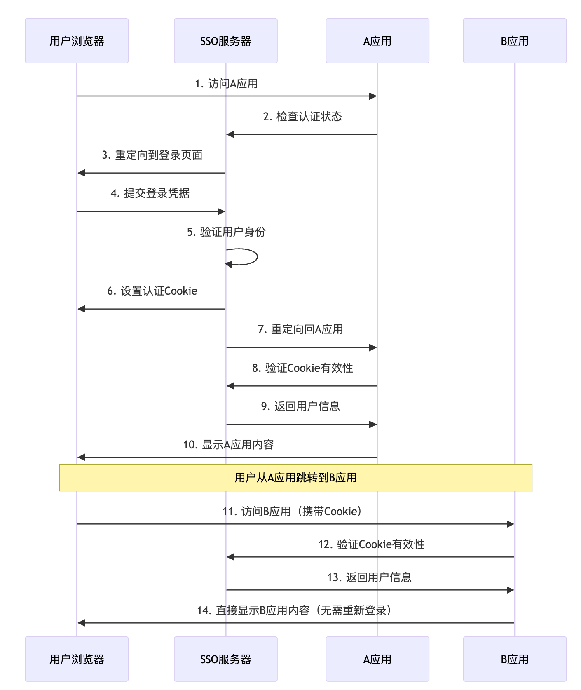

## 前言

在现代企业级应用开发中，单点登录（SSO）已经成为提升用户体验和简化系统管理的重要技术手段。然而，在实际实施过程中，开发者往往会遇到各种细节问题，其中Cookie的生命周期管理就是一个容易被忽视但影响重大的技术点。

本文将通过我参与的一个真实的项目案例，深入分析Cookie在SSO系统中的作用机制，并提供完整的解决方案和最佳实践。

## 背景介绍

### 项目概况

我为公司开发的财务软件搭建了一个SSO（Single Sign-On，单点登录）服务器，用于实现用户在多个应用系统之间的统一身份认证。公司的财务软件主要由两个独立应用组成：

- **财务应用（A应用）**：负责财务核算、报表生成等核心财务功能
- **ERP应用（B应用）**：负责业务流程管理、数据录入等业务功能

在业务流转过程中，A应用和B应用存在多处相互跳转的场景，例如：
- 在A应用中查看凭证时，需要跳转到B应用查看凭证的业务源单
- 在B应用中生成业务单据后，需要跳转到A应用下推相关财务凭证

<!-- more -->

### SSO系统架构

我们的SSO系统采用基于Cookie的会话管理机制，整体架构如下：

```
┌─────────────┐    ┌───────────────┐    ┌──────────────┐
│   用户浏览器 │    │ SSO认证服务器   │    │   应用服务器   │
│             │    │               │    │  (A应用/B应用)│
│  ┌─────────┐ │    │  ┌─────────┐ │    │  ┌─────────┐ │
│  │ Cookie  │ │◄──►│  │会话存储  │ │◄──►│  │业务逻辑   │ │
│  └─────────┘ │    │  └─────────┘ │    │  └─────────┘ │
└─────────────┘    └───────────────┘    └──────────────┘
```

## Cookie基础知识

在深入分析问题之前，我们先来了解一下Cookie的基本概念和重要属性。

### 什么是Cookie？

Cookie是服务器发送到用户浏览器并保存在本地的一小块数据，它会在浏览器下次向同一服务器再发起请求时被携带并发送到服务器上。Cookie主要用于以下三个方面：

1. **会话状态管理**：如用户登录状态、购物车、游戏分数等
2. **个性化设置**：如用户自定义设置、主题等
3. **浏览行为跟踪**：如跟踪分析用户行为等

### Cookie的重要属性

| 属性 | 说明 | 示例 |
|------|------|------|
| **Name/Value** | Cookie的名称和值 | `sessionId=abc123` |
| **Domain** | 指定Cookie的域名范围 | `.example.com` |
| **Path** | 指定Cookie的路径范围 | `/app` |
| **Expires/Max-Age** | 指定Cookie的过期时间 | `Max-Age=3600` |
| **Secure** | 仅在HTTPS连接中传输 | `Secure` |
| **HttpOnly** | 禁止JavaScript访问 | `HttpOnly` |
| **SameSite** | 控制跨站请求时的发送行为 | `SameSite=Strict` |

### Cookie的生命周期

Cookie的生命周期主要分为两种类型：

1. **会话期Cookie（Session Cookie）**
   - 没有设置`Expires`或`Max-Age`属性
   - 浏览器关闭时自动删除
   - 存储在内存中，不会写入硬盘

2. **持久性Cookie（Persistent Cookie）**
   - 设置了`Expires`或`Max-Age`属性
   - 在指定时间后过期
   - 存储在硬盘中，浏览器重启后仍然存在

## SSO单点登录原理详解

### 基本工作流程

我们的SSO系统采用基于Cookie的认证机制，其工作流程如下：



### 关键技术点

1. **统一域名策略**：所有应用和SSO服务器使用相同的顶级域名
2. **Cookie共享机制**：通过设置合适的Domain属性实现Cookie跨应用共享
3. **安全令牌管理**：使用加密的会话令牌确保安全性
4. **会话同步机制**：确保各应用间的会话状态一致性

## 问题发现与分析

### 问题现象

在系统上线测试过程中，业务同事反馈了一个奇怪的现象：

**正常情况**：用户首次通过SSO登录进入A应用，然后跳转到B应用，可以正常访问，无需重新登录。

**异常情况**：用户在使用过程中关闭浏览器，再次打开浏览器访问A应用，此时A应用可以正常访问（说明A应用自身的会话管理正常），但当用户从A应用跳转到B应用时，B应用要求用户重新登录。

### 问题复现步骤

1. 用户首次访问A应用，被重定向到SSO登录页面
2. 用户输入凭据完成登录，成功进入A应用
3. 用户在A应用中正常操作，然后**关闭浏览器**
4. 用户重新打开浏览器，直接访问A应用（可以正常访问）
5. 用户点击链接跳转到B应用，**被要求重新登录**

### 初步分析

基于问题现象，我初步分析可能的原因：

1. **A应用的会话管理**：A应用使用了自己的Token存储机制，不依赖于浏览器Cookie。（事实上，A应用是基于Vue开发的，将Token存储到了LocalStorage或持久化Cookie中）
2. **SSO Cookie失效**：SSO服务器设置的Cookie可能在浏览器关闭后失效
3. **B应用的认证依赖**：B应用完全依赖SSO Cookie进行身份验证

这种情况下，就会出现A应用可以访问但B应用需要重新登录的不一致现象。

### 深入技术分析

通过对系统架构和用户行为的分析，我确定了问题的根本原因：

#### 会话管理机制差异

1. **A应用的会话管理**
   - A应用使用了独立的会话存储机制（依赖LocalStorage或持久化Cookie）
   - 不完全依赖SSO Cookie，因此浏览器重启后仍能保持登录状态

2. **B应用的会话管理**
   - B应用完全依赖SSO服务器的Cookie进行身份验证
   - 没有独立的会话存储机制
   - SSO Cookie失效后无法验证用户身份

3. **SSO服务器的Cookie配置**
   - 使用了默认的会话级Cookie（Session Cookie）
   - 浏览器关闭后Cookie自动失效
   - 缺少持久化配置

#### 问题根因定位

为了验证我的分析，我检查了SSO服务器的Cookie设置代码：

```java
/**
 * 原始的Cookie设置代码 - 存在问题的版本
 */
public void setAuthenticationCookie(HttpServletRequest request, 
                                   HttpServletResponse response, 
                                   String name, String value, String path) {
    Cookie cookie = new Cookie(name, value);
    
    // 设置Cookie路径
    if (path != null) {
        cookie.setPath(path);
    }
    
    // HTTPS环境下设置Secure属性
    if ("https".equals(request.getScheme())) {
        cookie.setSecure(true);
    }
    
    // 设置HttpOnly，防止JavaScript访问Cookie，提高安全性
    cookie.setHttpOnly(true);
    
    // ❌ 问题所在：没有设置MaxAge，默认为会话级Cookie
    // 浏览器关闭后Cookie自动失效
    
    response.addCookie(cookie);
}
```

**问题分析**：
- 代码中没有调用 `cookie.setMaxAge()` 方法
- 默认情况下，Cookie是会话级的（Session Cookie）
- 浏览器关闭后，会话级Cookie会被自动删除
- 这导致用户重新打开浏览器后，SSO认证状态丢失

## 解决方案

### 设置Cookie过期时间

```java
/**
 * 改进后的Cookie设置代码 - 解决方案
 */
public void setAuthenticationCookie(HttpServletRequest request, 
                                   HttpServletResponse response, 
                                   String name, String value, String path) {
    Cookie cookie = new Cookie(name, value);
    
    // 设置Cookie路径，通常设置为根路径以便所有应用共享
    if (path != null) {
        cookie.setPath(path);
    } else {
        cookie.setPath("/"); // 默认根路径
    }
    
    // 设置Cookie域名，支持子域名共享
    // 例如：.example.com 可以被 app1.example.com 和 app2.example.com 共享
    String domain = extractDomain(request.getServerName());
    if (domain != null) {
        cookie.setDomain(domain);
    }
    
    // HTTPS环境下设置Secure属性
    if ("https".equals(request.getScheme())) {
        cookie.setSecure(true);
    }
    
    // 设置HttpOnly，防止JavaScript访问Cookie
    cookie.setHttpOnly(true);
    
    // ✅ 关键修复：设置Cookie有效期
    // 7天 = 7 * 24 * 60 * 60 秒
    cookie.setMaxAge(60 * 60 * 24 * 7);
    
    // 设置SameSite属性（Java 8以后版本需要手动设置响应头）
    // cookie.setSameSite("Lax"); // 如果支持的话，Lax模式可以防止CSRF攻击
    
    response.addCookie(cookie);
    
    // 对于不支持setSameSite的Java版本，手动设置响应头
    String cookieHeader = String.format("%s=%s; Path=%s; Max-Age=%d; HttpOnly; SameSite=Lax",
        name, value, cookie.getPath(), cookie.getMaxAge());
    if (cookie.getSecure()) {
        cookieHeader += "; Secure";
    }
    if (cookie.getDomain() != null) {
        cookieHeader += "; Domain=" + cookie.getDomain();
    }
    response.addHeader("Set-Cookie", cookieHeader);
}

/**
 * 提取域名的辅助方法
 */
private String extractDomain(String serverName) {
    if (serverName == null || serverName.isEmpty()) {
        return null;
    }
    
    // 对于localhost或IP地址，不设置domain
    if (serverName.equals("localhost") || serverName.matches("\\d+\\.\\d+\\.\\d+\\.\\d+")) {
        return null;
    }
    
    // 提取顶级域名，例如从 app1.example.com 提取 .example.com
    String[] parts = serverName.split("\\.");
    if (parts.length >= 2) {
        return "." + parts[parts.length - 2] + "." + parts[parts.length - 1];
    }
    
    return null;
}
```

### 配置化管理

在上述方案的基础上，为了更好的可维护性，可以进一步将Cookie配置参数化：

```java
/**
 * Cookie配置类
 */
@Configuration
public class CookieConfig {
    
    @Value("${sso.cookie.max-age:604800}") // 默认7天
    private int maxAge;
    
    @Value("${sso.cookie.domain:}")
    private String domain;
    
    @Value("${sso.cookie.path:/}")
    private String path;
    
    @Value("${sso.cookie.secure:true}")
    private boolean secure;
    
    @Value("${sso.cookie.http-only:true}")
    private boolean httpOnly;
    
    @Value("${sso.cookie.same-site:Lax}")
    private String sameSite;
    
    // getter和setter方法...
}

/**
 * 使用配置的Cookie工具类
 */
@Component
public class CookieUtil {
    
    @Autowired
    private CookieConfig cookieConfig;
    
    public void setAuthenticationCookie(HttpServletRequest request,
                                       HttpServletResponse response,
                                       String name, String value) {
        Cookie cookie = new Cookie(name, value);
        
        // 应用配置
        cookie.setPath(cookieConfig.getPath());
        cookie.setMaxAge(cookieConfig.getMaxAge());
        cookie.setHttpOnly(cookieConfig.isHttpOnly());
        
        if (cookieConfig.isSecure() && "https".equals(request.getScheme())) {
            cookie.setSecure(true);
        }
        
        if (StringUtils.hasText(cookieConfig.getDomain())) {
            cookie.setDomain(cookieConfig.getDomain());
        }
        
        response.addCookie(cookie);
    }
}
```

### 配置文件示例

```properties
# application.properties
sso.cookie.max-age=604800
sso.cookie.domain=.example.com
sso.cookie.path=/
sso.cookie.secure=true
sso.cookie.http-only=true
sso.cookie.same-site=Lax
```

## 安全性考虑

以上代码在设置Cookie持久化时，充分考虑了安全性问题。下面对相关属性进行详细说明：

### Cookie属性安全配置

| 属性 | 安全作用 | 推荐设置 |
|------|----------|----------|
| **HttpOnly** | 防止XSS攻击，禁止JavaScript访问 | `true` |
| **Secure** | 仅在HTTPS连接中传输 | 生产环境：`true` |
| **SameSite** | 防止CSRF攻击 | `Lax` 或 `Strict` |
| **Domain** | 限制Cookie作用域 | 最小必要原则 |
| **Path** | 限制Cookie路径范围 | 最小必要原则 |


## 最佳实践总结

### 1. Cookie配置最佳实践

```java
/**
 * 生产环境推荐的Cookie配置
 */
public class ProductionCookieConfig {
    
    public static Cookie createSecureCookie(String name, String value) {
        Cookie cookie = new Cookie(name, value);
        
        // 基本安全配置
        cookie.setHttpOnly(true);           // 防止XSS
        cookie.setSecure(true);             // 仅HTTPS传输
        cookie.setPath("/");                // 根路径
        cookie.setMaxAge(7 * 24 * 60 * 60); // 7天过期
        
        // 域名配置（根据实际情况调整）
        cookie.setDomain(".yourdomain.com");
        
        return cookie;
    }
}
```

### 2. 监控和日志

```java
/**
 * Cookie相关的监控和日志
 */
@Component
public class CookieMonitor {
    
    private static final Logger logger = LoggerFactory.getLogger(CookieMonitor.class);
    
    public void logCookieOperation(String operation, String cookieName, String userId, String clientIp) {
        logger.info("Cookie operation: {} | Cookie: {} | User: {} | IP: {} | Timestamp: {}",
                   operation, cookieName, userId, clientIp, Instant.now());
    }
    
    public void alertCookieAnomaly(String anomalyType, String details) {
        logger.warn("Cookie anomaly detected: {} | Details: {} | Timestamp: {}",
                   anomalyType, details, Instant.now());
        
        // 发送告警通知
        sendAlert(anomalyType, details);
    }
}
```

### 3. 测试策略

```java
/**
 * Cookie功能的单元测试
 */
@SpringBootTest
class CookieServiceTest {
    
    @Test
    void testCookieLifecycle() {
        // 测试Cookie创建
        Cookie cookie = cookieService.createAuthCookie("testUser", "testValue");
        assertThat(cookie.getMaxAge()).isEqualTo(7 * 24 * 60 * 60);
        assertThat(cookie.isHttpOnly()).isTrue();
        
        // 测试Cookie验证
        boolean isValid = cookieService.validateCookie(cookie.getValue());
        assertThat(isValid).isTrue();
        
        // 测试Cookie过期
        // ... 更多测试用例
    }
    
    @Test
    void testCrossDomainCookie() {
        // 测试跨域Cookie共享
        // ...
    }
}
```

## 问题解决结果

经过以上修改，我重新部署了SSO服务器，问题得到了完美解决：

1. **用户体验改善**：用户关闭浏览器后重新打开，仍然能在A、B应用间无缝切换
2. **会话一致性**：所有应用的登录状态保持同步
3. **安全性提升**：通过合理的Cookie配置和安全措施，确保系统安全
4. **可维护性增强**：通过配置化管理，便于后续调整和优化

希望这次经验分享能够帮助到遇到类似问题的开发者。

> 💡 **提示**：本文中代码示例仅供参考，在生产环境中使用前请根据实际情况进行调整和测试哦～
